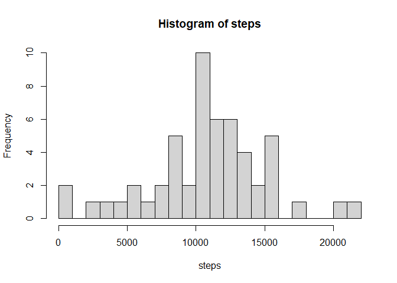
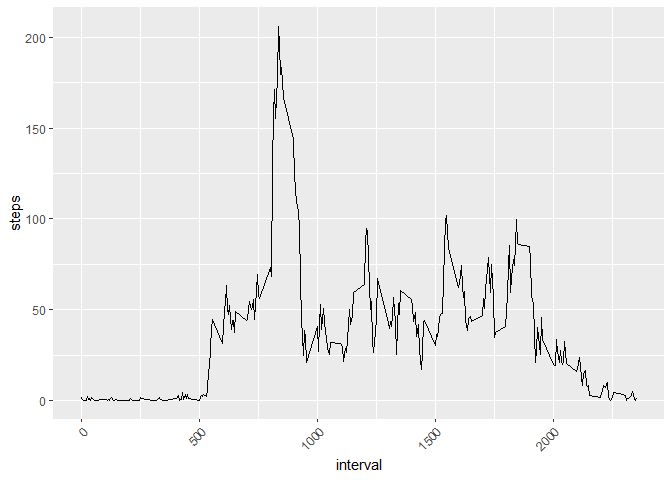
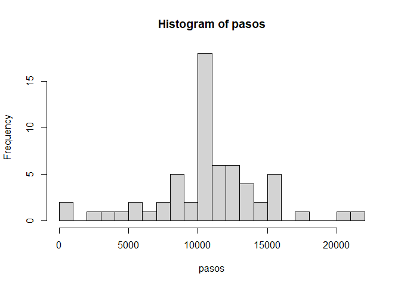
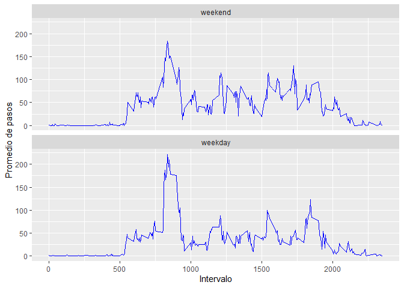

# Loading and preprocessing the data


### 1. Load the data (i.e. read.csv())


```r
DataFileName <- "./activity.zip"
dataDir <- "./data"


if (!file.exists(dataDir)) {
  dir.create(dataDir)
  unzip(zipfile = DataFileName, exdir = dataDir)
}


data <- read.csv("./data/activity.csv", header = TRUE, sep = ",")
data$date <- as.Date(data$date, format = "%Y-%m-%d")
data1 <- na.omit(data)
#data1$date <- as.Date(data1$date, format = "%Y-%m-%d")
```

### 2. Process/transform the data (if necessary) into a format suitable for your analysis


```r
total <- as.numeric(nrow(data))
total_step <- aggregate(steps ~ date, data = data, sum, na.rm = TRUE)
valid <- as.numeric(nrow(data1))
total_valid <- aggregate(steps ~ date, data = data1, sum, na.rm = TRUE)
percent <- trunc((total - valid)*100/total)
steps <- total_step$steps
```

There are **13**% of missing values ommited.

# What is mean total number of steps taken per day?

### 1. Make a histogram of the total number of steps taken each day

```r
hist(steps, breaks = 30)
```

<!-- -->

### 2. Calculate and report the mean and median total number of steps taken per day

### Summary of steps

```r
print(summary(data1$steps))
```

```
   Min. 1st Qu.  Median    Mean 3rd Qu.    Max. 
   0.00    0.00    0.00   37.38   12.00  806.00 
```


### Mean and median of steps by day

```r
library(xtable)
```

```
## Warning: package 'xtable' was built under R version 4.0.3
```

```r
library(dplyr)
```

```
## 
## Attaching package: 'dplyr'
```

```
## The following objects are masked from 'package:stats':
## 
##     filter, lag
```

```
## The following objects are masked from 'package:base':
## 
##     intersect, setdiff, setequal, union
```

```r
meanPerDay <- aggregate(steps ~ date, data1, mean)
names(meanPerDay)[2] <- "meanSteps"
medianPerDay <- aggregate(steps ~ date, data1, median)
names(medianPerDay)[2] <- "medianSteps"
summarySteps <- merge(meanPerDay,medianPerDay, all = TRUE)
tblMeanPerDay <- xtable(summarySteps)
tblMeanPerDay$date <- as.character(tblMeanPerDay$date)
print(tblMeanPerDay,type = "html")
```

<!-- html table generated in R 4.0.2 by xtable 1.8-4 package -->
<!-- Sat Feb 20 01:13:57 2021 -->
<table border=1>
<tr> <th>  </th> <th> date </th> <th> meanSteps </th> <th> medianSteps </th>  </tr>
  <tr> <td align="right"> 1 </td> <td align="right"> 2012-10-02 </td> <td align="right"> 0.44 </td> <td align="right"> 0.00 </td> </tr>
  <tr> <td align="right"> 2 </td> <td align="right"> 2012-10-03 </td> <td align="right"> 39.42 </td> <td align="right"> 0.00 </td> </tr>
  <tr> <td align="right"> 3 </td> <td align="right"> 2012-10-04 </td> <td align="right"> 42.07 </td> <td align="right"> 0.00 </td> </tr>
  <tr> <td align="right"> 4 </td> <td align="right"> 2012-10-05 </td> <td align="right"> 46.16 </td> <td align="right"> 0.00 </td> </tr>
  <tr> <td align="right"> 5 </td> <td align="right"> 2012-10-06 </td> <td align="right"> 53.54 </td> <td align="right"> 0.00 </td> </tr>
  <tr> <td align="right"> 6 </td> <td align="right"> 2012-10-07 </td> <td align="right"> 38.25 </td> <td align="right"> 0.00 </td> </tr>
  <tr> <td align="right"> 7 </td> <td align="right"> 2012-10-09 </td> <td align="right"> 44.48 </td> <td align="right"> 0.00 </td> </tr>
  <tr> <td align="right"> 8 </td> <td align="right"> 2012-10-10 </td> <td align="right"> 34.38 </td> <td align="right"> 0.00 </td> </tr>
  <tr> <td align="right"> 9 </td> <td align="right"> 2012-10-11 </td> <td align="right"> 35.78 </td> <td align="right"> 0.00 </td> </tr>
  <tr> <td align="right"> 10 </td> <td align="right"> 2012-10-12 </td> <td align="right"> 60.35 </td> <td align="right"> 0.00 </td> </tr>
  <tr> <td align="right"> 11 </td> <td align="right"> 2012-10-13 </td> <td align="right"> 43.15 </td> <td align="right"> 0.00 </td> </tr>
  <tr> <td align="right"> 12 </td> <td align="right"> 2012-10-14 </td> <td align="right"> 52.42 </td> <td align="right"> 0.00 </td> </tr>
  <tr> <td align="right"> 13 </td> <td align="right"> 2012-10-15 </td> <td align="right"> 35.20 </td> <td align="right"> 0.00 </td> </tr>
  <tr> <td align="right"> 14 </td> <td align="right"> 2012-10-16 </td> <td align="right"> 52.38 </td> <td align="right"> 0.00 </td> </tr>
  <tr> <td align="right"> 15 </td> <td align="right"> 2012-10-17 </td> <td align="right"> 46.71 </td> <td align="right"> 0.00 </td> </tr>
  <tr> <td align="right"> 16 </td> <td align="right"> 2012-10-18 </td> <td align="right"> 34.92 </td> <td align="right"> 0.00 </td> </tr>
  <tr> <td align="right"> 17 </td> <td align="right"> 2012-10-19 </td> <td align="right"> 41.07 </td> <td align="right"> 0.00 </td> </tr>
  <tr> <td align="right"> 18 </td> <td align="right"> 2012-10-20 </td> <td align="right"> 36.09 </td> <td align="right"> 0.00 </td> </tr>
  <tr> <td align="right"> 19 </td> <td align="right"> 2012-10-21 </td> <td align="right"> 30.63 </td> <td align="right"> 0.00 </td> </tr>
  <tr> <td align="right"> 20 </td> <td align="right"> 2012-10-22 </td> <td align="right"> 46.74 </td> <td align="right"> 0.00 </td> </tr>
  <tr> <td align="right"> 21 </td> <td align="right"> 2012-10-23 </td> <td align="right"> 30.97 </td> <td align="right"> 0.00 </td> </tr>
  <tr> <td align="right"> 22 </td> <td align="right"> 2012-10-24 </td> <td align="right"> 29.01 </td> <td align="right"> 0.00 </td> </tr>
  <tr> <td align="right"> 23 </td> <td align="right"> 2012-10-25 </td> <td align="right"> 8.65 </td> <td align="right"> 0.00 </td> </tr>
  <tr> <td align="right"> 24 </td> <td align="right"> 2012-10-26 </td> <td align="right"> 23.53 </td> <td align="right"> 0.00 </td> </tr>
  <tr> <td align="right"> 25 </td> <td align="right"> 2012-10-27 </td> <td align="right"> 35.14 </td> <td align="right"> 0.00 </td> </tr>
  <tr> <td align="right"> 26 </td> <td align="right"> 2012-10-28 </td> <td align="right"> 39.78 </td> <td align="right"> 0.00 </td> </tr>
  <tr> <td align="right"> 27 </td> <td align="right"> 2012-10-29 </td> <td align="right"> 17.42 </td> <td align="right"> 0.00 </td> </tr>
  <tr> <td align="right"> 28 </td> <td align="right"> 2012-10-30 </td> <td align="right"> 34.09 </td> <td align="right"> 0.00 </td> </tr>
  <tr> <td align="right"> 29 </td> <td align="right"> 2012-10-31 </td> <td align="right"> 53.52 </td> <td align="right"> 0.00 </td> </tr>
  <tr> <td align="right"> 30 </td> <td align="right"> 2012-11-02 </td> <td align="right"> 36.81 </td> <td align="right"> 0.00 </td> </tr>
  <tr> <td align="right"> 31 </td> <td align="right"> 2012-11-03 </td> <td align="right"> 36.70 </td> <td align="right"> 0.00 </td> </tr>
  <tr> <td align="right"> 32 </td> <td align="right"> 2012-11-05 </td> <td align="right"> 36.25 </td> <td align="right"> 0.00 </td> </tr>
  <tr> <td align="right"> 33 </td> <td align="right"> 2012-11-06 </td> <td align="right"> 28.94 </td> <td align="right"> 0.00 </td> </tr>
  <tr> <td align="right"> 34 </td> <td align="right"> 2012-11-07 </td> <td align="right"> 44.73 </td> <td align="right"> 0.00 </td> </tr>
  <tr> <td align="right"> 35 </td> <td align="right"> 2012-11-08 </td> <td align="right"> 11.18 </td> <td align="right"> 0.00 </td> </tr>
  <tr> <td align="right"> 36 </td> <td align="right"> 2012-11-11 </td> <td align="right"> 43.78 </td> <td align="right"> 0.00 </td> </tr>
  <tr> <td align="right"> 37 </td> <td align="right"> 2012-11-12 </td> <td align="right"> 37.38 </td> <td align="right"> 0.00 </td> </tr>
  <tr> <td align="right"> 38 </td> <td align="right"> 2012-11-13 </td> <td align="right"> 25.47 </td> <td align="right"> 0.00 </td> </tr>
  <tr> <td align="right"> 39 </td> <td align="right"> 2012-11-15 </td> <td align="right"> 0.14 </td> <td align="right"> 0.00 </td> </tr>
  <tr> <td align="right"> 40 </td> <td align="right"> 2012-11-16 </td> <td align="right"> 18.89 </td> <td align="right"> 0.00 </td> </tr>
  <tr> <td align="right"> 41 </td> <td align="right"> 2012-11-17 </td> <td align="right"> 49.79 </td> <td align="right"> 0.00 </td> </tr>
  <tr> <td align="right"> 42 </td> <td align="right"> 2012-11-18 </td> <td align="right"> 52.47 </td> <td align="right"> 0.00 </td> </tr>
  <tr> <td align="right"> 43 </td> <td align="right"> 2012-11-19 </td> <td align="right"> 30.70 </td> <td align="right"> 0.00 </td> </tr>
  <tr> <td align="right"> 44 </td> <td align="right"> 2012-11-20 </td> <td align="right"> 15.53 </td> <td align="right"> 0.00 </td> </tr>
  <tr> <td align="right"> 45 </td> <td align="right"> 2012-11-21 </td> <td align="right"> 44.40 </td> <td align="right"> 0.00 </td> </tr>
  <tr> <td align="right"> 46 </td> <td align="right"> 2012-11-22 </td> <td align="right"> 70.93 </td> <td align="right"> 0.00 </td> </tr>
  <tr> <td align="right"> 47 </td> <td align="right"> 2012-11-23 </td> <td align="right"> 73.59 </td> <td align="right"> 0.00 </td> </tr>
  <tr> <td align="right"> 48 </td> <td align="right"> 2012-11-24 </td> <td align="right"> 50.27 </td> <td align="right"> 0.00 </td> </tr>
  <tr> <td align="right"> 49 </td> <td align="right"> 2012-11-25 </td> <td align="right"> 41.09 </td> <td align="right"> 0.00 </td> </tr>
  <tr> <td align="right"> 50 </td> <td align="right"> 2012-11-26 </td> <td align="right"> 38.76 </td> <td align="right"> 0.00 </td> </tr>
  <tr> <td align="right"> 51 </td> <td align="right"> 2012-11-27 </td> <td align="right"> 47.38 </td> <td align="right"> 0.00 </td> </tr>
  <tr> <td align="right"> 52 </td> <td align="right"> 2012-11-28 </td> <td align="right"> 35.36 </td> <td align="right"> 0.00 </td> </tr>
  <tr> <td align="right"> 53 </td> <td align="right"> 2012-11-29 </td> <td align="right"> 24.47 </td> <td align="right"> 0.00 </td> </tr>
   </table>


```r
promedio <- trunc(mean(total_step$steps))
mediana <- median(total_step$steps)
```

The mean of total number of steps taken  is **1.0766\times 10^{4}**

The median of total number of steps taken is **10765**


# What is the average daily activity pattern?


### 1. Make a time series plot (i.e. type = "l") of the 5-minute interval (x-axis) and the average number of steps taken, averaged across all days (y-axis)


```r
library(ggplot2)
library(dplyr)


meanStepInterval <- aggregate(steps ~ interval, data1, mean)

ggplot(meanStepInterval, aes(interval, steps)) +
  geom_line() +
  theme(axis.text.x = element_text(angle=45, hjust=1, vjust = 1))
```

<!-- -->

```r
maxStepInterval <- meanStepInterval[which.max(meanStepInterval$steps),]
maxInterval <- maxStepInterval$interval
maxStep <- maxStepInterval$steps
```

### 2. Which 5-minute interval, on average across all the days in the dataset,contains the maximum number of steps?


A: The 5-minute interval that contains the maximum number of steps is **835** with an average of **206.1698113** steps  

# Imputing missing values
Note that there are a number of days/intervals where there are missing values
(coded as NA). The presence of missing days may introduce bias into some
calculations or summaries of the data.


### 1. Calculate and report the total number of missing values in the dataset (i.e. the total number of rows with NAs)


```r
total <- as.numeric(nrow(data))
valid <- as.numeric(nrow(data1))
missingValues <- total - valid
percent <- trunc((total - valid)*100/total)
steps <- data1$steps
```
 There are **2304** missing values, a **13**% of total values.


### 2. Devise a strategy for filling in all of the missing values in the dataset. The strategy does not need to be sophisticated. For example, you could usethe mean/median for that day, or the mean for that 5-minute interval, etc.


We'll use the mean for 5 - minutes interval to fill the missing values in dataset


```r
dato3 <- data

prom_step <- aggregate(steps ~ interval, data, mean, na.rm = TRUE)
```

### 3. Create a new dataset that is equal to the original dataset but with the missing data filled in.


```r
for (i in prom_step$interval) {
    dato3[dato3$interval == i & is.na(dato3$steps), ]$steps <- 
        prom_step$steps[prom_step$interval == i]
}
```

### 4. Make a histogram of the total number of steps taken each day and Calculate and report the mean and median total number of steps taken per day. Do these values differ from the estimates from the first part of the assignment? What is the impact of imputing missing data on the estimates of the total daily number of steps?


```r
total_num_step <- aggregate(steps ~ date, dato3,sum,na.rm = TRUE)

pasos <- total_num_step$steps

hist(pasos, breaks = 30)
```

<!-- -->


# Are there differences in activity patterns between weekdays and weekends? For this part the weekdays() function may be of some help here. Use the dataset with the filled-in missing values for this part.

### 1. Create a new factor variable in the dataset with two levels – “weekday” and “weekend” indicating whether a given date is a weekday or weekend day.


```r
dato4 <- dato3

dato4$date <- as.Date(dato4$date)
#create a vector of weekdays
weekdays1 <- c('lunes', 'martes', 'miercoles', 'jueves', 'viernes')
#Use `%in%` and `weekdays` to create a logical vector
#convert to `factor` and specify the `levels/labels`
dato4$wday <- factor((weekdays(dato4$date) %in% weekdays1), levels=c(FALSE, TRUE),labels=c('weekend', 'weekday'))
```
         

### 2. Make a panel plot containing a time series plot (i.e. type = "l") of the 5-minute interval (x-axis) and the average number of steps taken, averaged across all weekday days or weekend days (y-axis). The plot should look something like the following, which was creating using simulated data:


```r
finde <- aggregate(steps ~ wday + interval, mean,data = dato4)


#str(finde)

ggplot(finde,
       aes(x = interval, y = steps)) +
  xlab("Intervalo") + ylab("Promedio de pasos") +
  geom_line(color = "blue") +
  facet_wrap (~wday, ncol = 1)
```

<!-- -->


